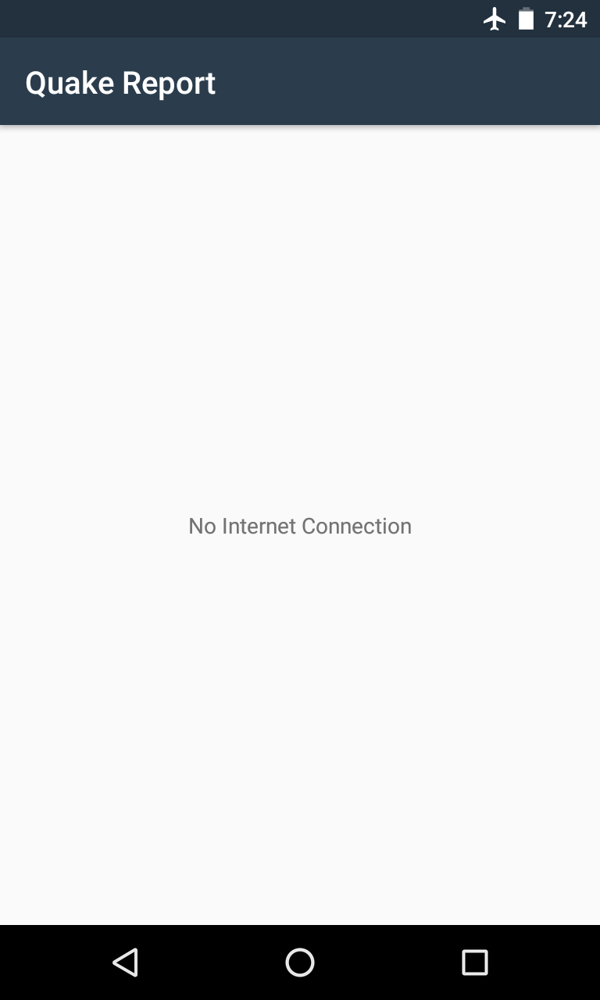
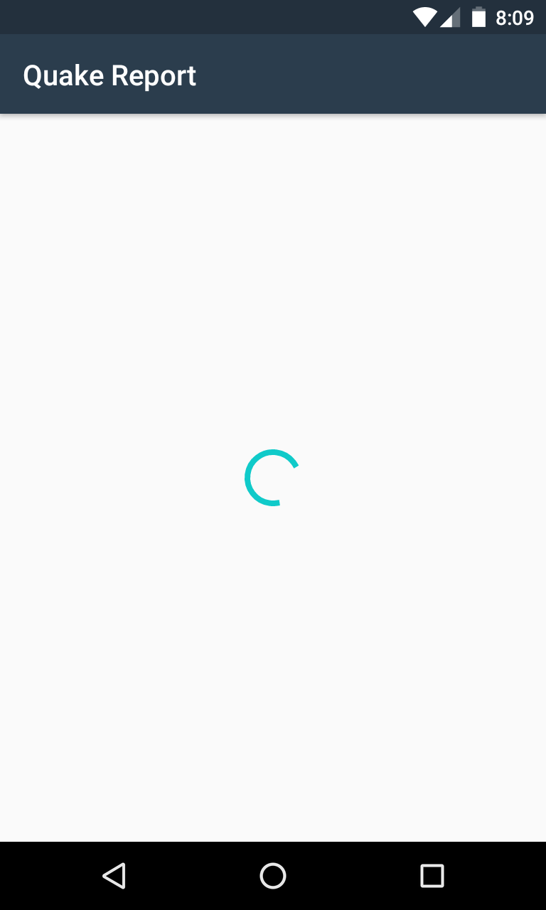

Quake Report App
===================================

This app displays a list of recent earthquakes in the world
from the U.S. Geological Survey (USGS) organization.

More info on the USGS Earthquake API available at:
https://earthquake.usgs.gov/fdsnws/event/1/

Getting Started
---------------

This sample uses the Gradle build system. To build this project, use the
"gradlew build" command or use "Import Project" in Android Studio.

What I've learned :
--------------------
Using AsyncTasks to connect to the internet.

Using AsyncTasksLoader to connect to the internet.

Reading and parsing JSON data.

Customizing ListViews,using ArrayLists & ArrayAdapters.

Using progress bar and listview empty for better UX.

Screeshots
----------

     
    
  

